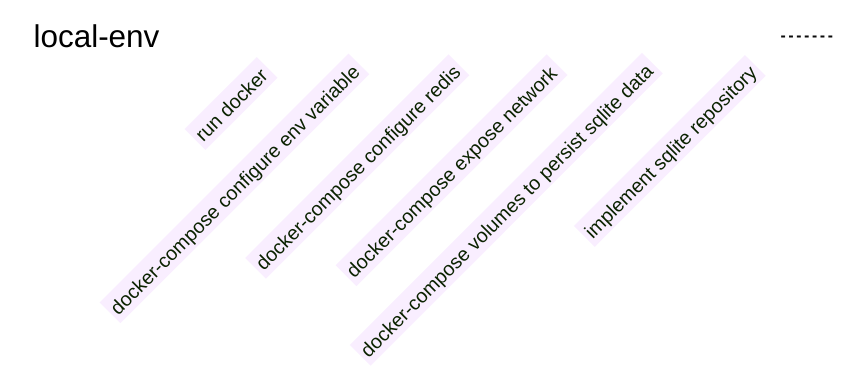

Sometime, even if it's not that easy, trying hard to resolve something you are not sure about, at the end you can be 
proud about what you've done and god it's good to feel proud about something you achieved.

## The context
With one of my colleague, we were working on a solution that would ensure a proper graceful shutdown for a `NodeJS` application.

**The problem :**
- Asynchronous services to process thousands of data that gives business insight for our clients (message loss tolerance is 0)
- A parent process forking a child process to instantiate a redis consumer queue
- A queue consumer instance which is not available from the parent process
- A `SIGTERM` sent on a node child process will instantly kill the child
  - Any consumer running at this time would be instantly killed resulting in:
    - queue consumed messages loss
    - missing to be processed data for our client
- A local environment not ready to test this kind of scenario
- The feedback loop was around 20 to 35 minutes (too long!) with at least all these steps:
  - commit / push
  - CI running:
    - execute test (4-5 minutes)
    - dockerize (3 minutes)
    - publish docker image (3 minutes)
    - deploy docker container (2 minutes)
    - create a new test instance (2 minutes)
    - clean data (2 minutes)
    - launch test (4-15 minutes)
    - observe result (1 minute)

Below is an example of our activity:

As you can see there is a pattern with a long time interval between commit/push and test session (let's say around 6 to 8 tests a day).

BTW, thanks to [@Arnaud Bailly](https://twitter.com/dr_c0d3) and his wonderful [sensei project](https://github.com/abailly/sensei)

## Entering the solution space
**Our work in progress :**

Understand the current behaviour which can be resumed to:

What we intend to do, listen to a `SIGTERM` signal from the main node process, and properly shutdown the service by propagating the information
to the forked child. Which can be resumed to:

Still, we are slowed down by the all process and feedback loop. Let's take a step back for a moment and see if we don't 
have a solution to drop our feedback loop.

### How to drop feedback loop
- By removing the actions that take time
- By decreasing the number of actions

In our context it was obvious we should target our local development environment instead of going on a staging environment.

... we don't have a maintained local environment 😱, no problem, let's experiment and identify what is needed to have a local environment.

