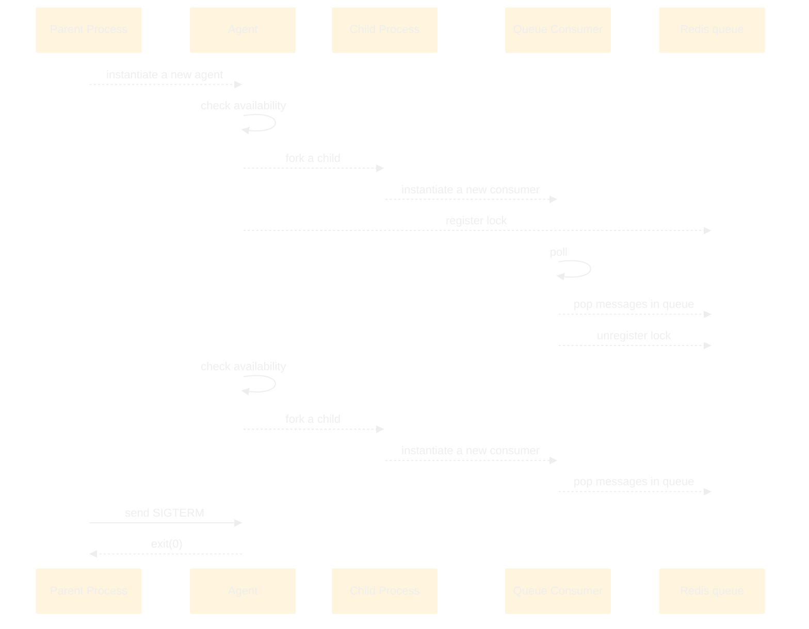
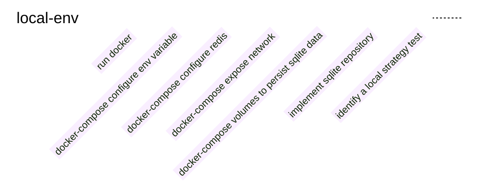

Sometime, even if it's not that easy, trying hard to resolve something you are not sure about, at the end you can be 
proud about what you've done and god it's good to feel proud about something you achieved.

## The context
With one of my colleague, we were working on a solution that would ensure a proper graceful shutdown for a `NodeJS` application.

Below is a minimized C4 model.

```plantuml!
@startuml
!define ICONURL https://raw.githubusercontent.com/tupadr3/plantuml-icon-font-sprites/v2.4.0
!include ICONURL/devicons/react.puml
!define ICONURL https://raw.githubusercontent.com/tupadr3/plantuml-icon-font-sprites/v2.4.0
!include ICONURL/devicons/nodejs.puml

!include https://raw.githubusercontent.com/adrianvlupu/C4-PlantUML/latest/C4_Container.puml

skinparam backgroundColor #BBB
LAYOUT_WITH_LEGEND()

Person(user, "User", "A person using our system and interested about retrieving data from our service.")

System_Ext(extserv, "External service", "An external service pushing events on our REST API.")
System_Ext(redis, "Redis", "The redis server responsible to queue the messages received on events resource.")
System_Ext(database, "Events database", "The database where events are stored.")


System_Boundary(system, "Our system") {
    Container(agent, "Agent", "The agent responsible to check queues and instantiate queue consumers.", $sprite="nodejs")
    Container(ra, "REST Application", "Delivers REST resources.", $sprite="nodejs")

    Rel(extserv, ra, "Post events")
    Rel(ra, redis, "Publish events on a queue")

}

Rel(user, system, "Uses the service")
Rel(agent, redis, "Check/read queues")
Rel(agent, database, "Persist events")

@enduml
```

**The problem :**
- Asynchronous services to process thousands of data that gives business insight for our clients (message loss tolerance is 0)
- A parent process forking a child process to instantiate a redis consumer queue
- A queue consumer instance which is not available from the parent process
- A `SIGTERM` sent on a node child process will instantly kill the child
  - Any consumer running at this time would be instantly killed resulting in:
    - queue consumed messages loss
    - missing to be processed data for our client
- A local environment not ready to test this kind of scenario
- The feedback loop was around 20 to 35 minutes (too long!) with at least all these steps:
  - commit / push
  - CI running:
    - execute test (4-5 minutes)
    - dockerize (3 minutes)
    - publish docker image (3 minutes)
    - deploy docker container (2 minutes)
    - create a new test instance (2 minutes)
    - clean data (2 minutes)
    - launch test (4-15 minutes)
    - observe result (1 minute)

Below is an example of our activity:
[  ](/assets/images/2022-09-29_2.png)

[  ](/assets/images/2022-09-29_1.png)

As you can see there is a pattern with a long time interval between commit/push and test session (let's say around 6 to 8 tests a day).

BTW, thanks to [@Arnaud Bailly](https://twitter.com/dr_c0d3) and his wonderful [sensei project](https://github.com/abailly/sensei)

## Entering the solution space
**Our work in progress :**

Understand the current behaviour which can be resumed to:



What we intend to do, listen to a `SIGTERM` signal from the main node process, and properly shutdown the service by propagating the information
to the forked child. Which can be resumed to:


Still, we are slowed down by the all process and feedback loop. Let's take a step back for a moment and see if we don't 
have a solution to drop our feedback loop.

### How to drop feedback loop?
- By removing the actions that take time
- By decreasing the number of actions

In our context it was obvious we should target our local development environment instead of going on a staging environment.

... we don't have a maintained local environment 😱, no problem, let's experiment and identify what is needed to have a local environment.



#### Identify a local strategy test
How to prove that our workaround is working?
1. Run the app on a docker container
2. Run a redis service on a docker container
3. Send a few thousand requests on the resource exposed to handle events
4. Check that redis queues are created and populated
5. Store the events in a database
6. Expose the database file on a docker volume (we need to have a persistent db file that is updated after each restart)
7. Run a `docker stop CONTAINER` command
8. Check that the numbers add up between the events stored in database znd the events left in the queue
9. Restart the docker container
10. Check the redis queue is consumed
11. Re-run from step **7**

#### Implement sqlite repository
**Prerequisites :** `npm install sqlite sqlite3`

**Purpose :**
- Persist our events on a local database
- No dependency with a distant service to persist data during test sessions on a local environment
- Easily inspect results during test sessions

Fortunately we did some weeks ago a refactoring work to add some abstraction and separation of concerns regarding our persistence layer.
Basically, we use the `Repository` pattern ([See Eric Evans DDD blue book](https://www.eyrolles.com/Informatique/Livre/domain-driven-design-9780321125217/)).

Thanks to this pattern and the previous work, what we needed is:
```typescript
export interface Repository<T> {
    persist(entity: T): Promise<void>
}

abstract class AbstractSQLiteEntitiesRepository<T> implements Repository<T> {

    async persist(entities: T): Promise<void> {
        return Promise.resolve({
            /*
            persist the entities
             */
        })
    }
}

export type EventsRepository = Repository<Events>

export class SQLiteEventsRepository
  extends AbstractSQLiteEntitiesRepository<Events>
  implements EventsRepository
{
    query(entities: Events): Promise<void> {
        return Promise.resolve(
            /*
            run the query
             */
        )
    }
}

// And then we replace the actual repository injection

await handleEvents({
    events: SQLiteEventsRepository, // SQLiteEventsRepository instead of DistantEventsRepository
})
```

#### Configure docker
**docker-compose volumes to persist sqlite data :**

For redis: 
```dockerfile
version: '3.4'

services:

  redis:
    image: redis:6.2.7-alpine
    container_name: redis
    healthcheck:
      test: redis-cli -p 6379 ping > /dev/null && echo OK
      retries: 3
      timeout: 3s
    ports:
      - "6379:6379"
    volumes:
      - "./volumes/redis/data:/data"
    network_mode: bridge
    restart: unless-stopped
```

For the agent:
```dockerfile
  agent:
    build:
      context: ..
      dockerfile: deployments/app/Dockerfile
      args:
        NODE_VERSION: ${NODE_VERSION}
        NPM_VERSION: ${NPM_VERSION}
        PORT: ${PORT}
      target: local-agent
    links:
      - redis
    environment:
      - NODE_ENV
      - LOG_LEVEL
      - SQLITE_FILEPATH
      - QUEUE_TYPE
      - QUEUE_CONSUMER_TYPE
      - QUEUE_BATCH_SIZE
      - QUEUE_AGENT_WORKER_TTL
      - QUEUE_BATCH_TIMEOUT
      - QUEUE_POLL_FREQ
      - REDIS_HOST=redis
      - REDIS_PORT=6379
    ports:
      - 3001:3000
    network_mode: bridge

    volumes:
      - "./volumes/db/data:/usr/db/data"
    restart: unless-stopped
```

And finally the main app:
```dockerfile

  app:
    build:
      context: ..
      dockerfile: deployments/app/Dockerfile
      args:
        NODE_VERSION: ${NODE_VERSION}
        NPM_VERSION: ${NPM_VERSION}
        PORT: ${PORT}
      target: app
    ports:
      - "${PORT}:${PORT}"
    healthcheck:
      test: curl -f -s -o /dev/null http://localhost:${PORT}/health && echo OK
      retries: 3
      timeout: 3s
    links:
      - redis
    environment:
      - NODE_ENV
      - LOG_LEVEL
      - PORT
      - REDIS_HOST=redis
      - REDIS_PORT=6379
    labels:
      - traefik.enable=true
      - traefik.http.routers.connector.rule=Host(`host.${BASE_DOMAIN:-localdomain}`)
      - traefik.http.routers.connector.entrypoints=websecure
      - traefik.http.routers.connector.tls.certresolver=myresolver
    network_mode: bridge
    restart: unless-stopped
```


