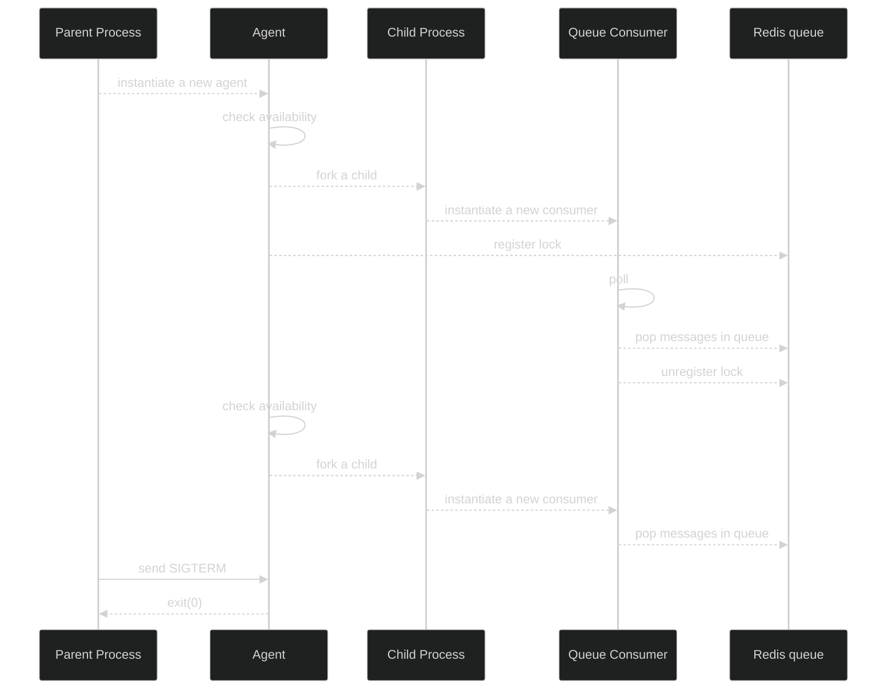
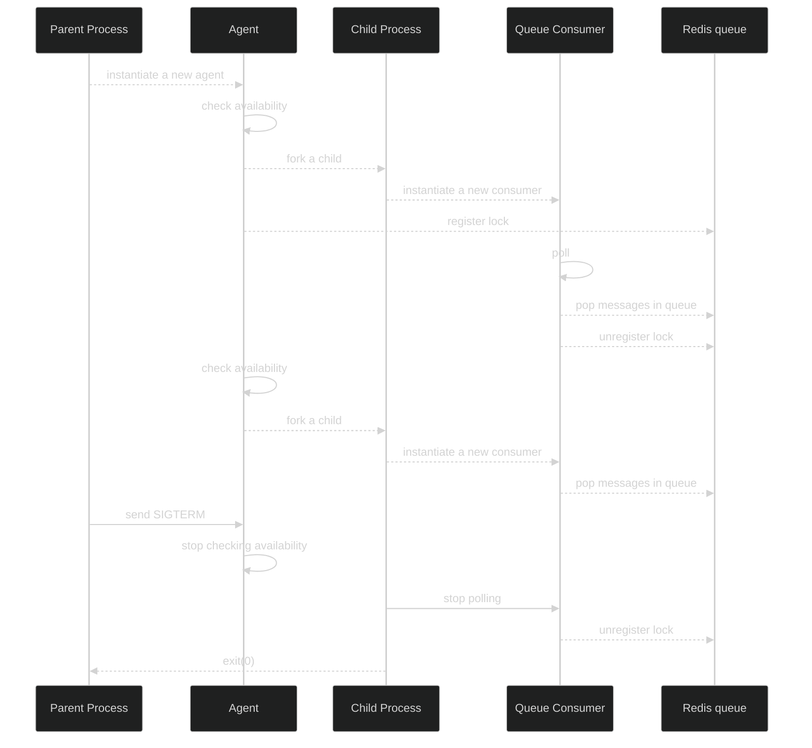
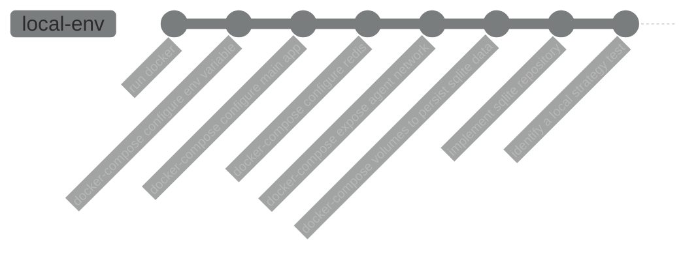

Sometime, even if it's not that easy, trying hard to resolve something you are not sure about, at the end you can be 
proud about what you've done and God it's good to feel proud about something you achieved.

* TOC
{:toc}

## The context
With one of my colleague, we were working on a solution that would ensure a proper graceful shutdown for a `NodeJS` application.

Below is a minimized C4 model.

```plantuml!
@startuml
!define ICONURL https://raw.githubusercontent.com/tupadr3/plantuml-icon-font-sprites/v2.4.0
!include ICONURL/devicons/react.puml
!define ICONURL https://raw.githubusercontent.com/tupadr3/plantuml-icon-font-sprites/v2.4.0
!include ICONURL/devicons/nodejs.puml

!include https://raw.githubusercontent.com/adrianvlupu/C4-PlantUML/latest/C4_Container.puml

skinparam backgroundColor #BBB
LAYOUT_WITH_LEGEND()

Person(user, "User", "A person using our system and interested about retrieving data from our service.")

System_Ext(extserv, "External service", "An external service pushing events on our REST API.")
System_Ext(redis, "Redis", "The redis server responsible to queue the messages received on events resource.")
System_Ext(database, "Events database", "The database where events are stored.")


System_Boundary(system, "Our system") {
    Container(agent, "Agent", "The agent responsible to check queues and instantiate queue consumers.", $sprite="nodejs")
    Container(ra, "REST Application", "Delivers REST resources.", $sprite="nodejs")

    Rel(extserv, ra, "Post events")
    Rel(ra, redis, "Publish events on a queue")

}

Rel(user, system, "Uses the service")
Rel(agent, redis, "Check/read queues")
Rel(agent, database, "Persist events")

@enduml
```

**The problem :**
- Asynchronous services to process thousands of data that gives business insight for our clients (message loss tolerance is 0)
- A parent process forking a child process to instantiate a queue consumer
- A queue consumer instance which is not available from the parent process
- A `SIGTERM` sent on a node child process will instantly kill the child
  - Any consumer running at this time would be instantly killed resulting in:
    - queue consumed messages loss
    - missing to be processed data for our client
- A local environment not ready to test this kind of scenario
- The feedback loop was around 24 to 36 minutes (too long!) with at least all these steps:
  - commit / push
  - CI running:
    - execute test (5 minutes)
    - dockerize (5 minutes)
    - publish docker image (2 minutes)
    - deploy docker container (2 minutes)
  - create a new test instance (2 minutes)
  - clean data (2 minutes)
  - launch test (4-15 minutes)
  - observe result (2-3 minute)

Below is an example of our activity:
[  ](/assets/images/2022-09-29_2.png)

[  ](/assets/images/2022-09-29_1.png)

As you can see there is a pattern with a long time interval between commit/push and test session (let's say around 6 to 8 tests a day).

BTW, thanks to [@Arnaud Bailly](https://twitter.com/dr_c0d3) and his wonderful [sensei project](https://github.com/abailly/sensei)

## Entering the solution space
**Our work in progress :**

Understand the current behaviour which can be resumed to:



What we intend to do, listen to a `SIGTERM` signal from the main node process, and properly shutdown the service by propagating the information
to the forked child. Which can be resumed to:



Still, we are slowed down by the all process and feedback loop. Let's take a step back for a moment and see if we don't 
have a solution to reduce our feedback loop.

### How to reduce feedback loop?
- By removing the actions that take time
- By decreasing the number of actions

In our context it was obvious we should target our local development environment instead of going on a staging environment.

... we don't have a maintained local environment 😱, no problem, let's experiment and identify what is needed to have a local environment.



#### Identify a local strategy test
How to prove that our workaround is working?
1. Run the app on a docker container
2. Run a redis service on a docker container
3. Send a few thousand requests on the resource exposed to handle events
4. Check that redis queues are created and populated
5. Store the events in a database
6. Expose the database file on a docker volume (we need to have a persistent db file that is updated after each restart)
7. Run a `docker stop CONTAINER` command
8. Check that the numbers add up between the events stored in database end the events left in the queue
9. Restart the docker container
10. Check the redis queue is consumed
11. Re-run from step **7**

#### Implement sqlite repository
**Prerequisites :** `npm install sqlite sqlite3`

**Purpose :**
- Persist our events on a local database
- No dependency with a distant service to persist data during test sessions on a local environment
- Easily inspect results during test sessions

Fortunately we did some weeks ago a refactoring work to add some abstraction and separation of concerns regarding our persistence layer.
Basically, we use the `Repository` pattern ([See Eric Evans DDD blue book](https://www.eyrolles.com/Informatique/Livre/domain-driven-design-9780321125217/)).

Thanks to this pattern and the previous work, what we needed is:
```typescript
export interface Repository<T> {
    persist(entity: T): Promise<void>
}

abstract class AbstractSQLiteEntitiesRepository<T> implements Repository<T> {

    async persist(entities: T): Promise<void> {
        return Promise.resolve({
            /*
            persist the entities
             */
        })
    }
}

export type EventsRepository = Repository<Events>

export class SQLiteEventsRepository
  extends AbstractSQLiteEntitiesRepository<Events>
  implements EventsRepository
{
    query(entities: Events): Promise<void> {
        return Promise.resolve(
            /*
            run the query
             */
        )
    }
}

// And then we replace the actual repository injection

await handleEvents({
    events: SQLiteEventsRepository, // SQLiteEventsRepository instead of DistantEventsRepository
})
```

#### Configure docker
**docker-compose volumes to persist sqlite data :**
```yaml
  agent:
    build:
      context: ..
      dockerfile: deployments/app/Dockerfile
      args:
        NODE_VERSION: ${NODE_VERSION}
        NPM_VERSION: ${NPM_VERSION}
        PORT: ${PORT}
      target: local-agent

    volumes:
      - "./volumes/db/data:/usr/db/data"
    restart: unless-stopped
```

**docker-compose expose agent network :**
```diff

  agent:
    build:
      context: ..
      dockerfile: deployments/app/Dockerfile
      args:
        NODE_VERSION: ${NODE_VERSION}
        NPM_VERSION: ${NPM_VERSION}
        PORT: ${PORT}
    target: local-agent
+   ports:
+     - 3001:3000
+   network_mode: bridge

    volumes:
      - "./volumes/db/data:/usr/db/data"
    restart: unless-stopped
```
**docker-compose configure redis :**
```yaml
version: '3.4'

services:

  redis:
    image: redis:6.2.7-alpine
    container_name: redis
    healthcheck:
      test: redis-cli -p 6379 ping > /dev/null && echo OK
      retries: 3
      timeout: 3s
    ports:
      - "6379:6379"
    volumes:
      - "./volumes/redis/data:/data"
    network_mode: bridge
    restart: unless-stopped
```
**docker-compose configure main app :**

```yaml

  app:
    build:
      context: ..
      dockerfile: deployments/app/Dockerfile
      args:
        NODE_VERSION: ${NODE_VERSION}
        NPM_VERSION: ${NPM_VERSION}
        PORT: ${PORT}
      target: app
    ports:
      - "${PORT}:${PORT}"
    healthcheck:
      test: curl -f -s -o /dev/null http://localhost:${PORT}/health && echo OK
      retries: 3
      timeout: 3s
    links:
      - redis
    labels:
      - traefik.enable=true
      - traefik.http.routers.connector.rule=Host(`host.${BASE_DOMAIN:-localdomain}`)
      - traefik.http.routers.connector.entrypoints=websecure
      - traefik.http.routers.connector.tls.certresolver=myresolver
    network_mode: bridge
    restart: unless-stopped
```
**docker-compose configure env variable :**
```diff

  agent:
    build:
      context: ..
      dockerfile: deployments/app/Dockerfile
      args:
        NODE_VERSION: ${NODE_VERSION}
        NPM_VERSION: ${NPM_VERSION}
        PORT: ${PORT}
      target: local-agent
    links:
      - redis
+   environment:
+     - NODE_ENV
+     - LOG_LEVEL
+     - SQLITE_FILEPATH
+     - QUEUE_TYPE
+     - QUEUE_CONSUMER_TYPE
+     - QUEUE_BATCH_SIZE
+     - QUEUE_AGENT_WORKER_TTL
+     - QUEUE_BATCH_TIMEOUT
+     - QUEUE_POLL_FREQ
+     - REDIS_HOST=redis
+     - REDIS_PORT=6379
    ports:
      - 3001:3000
    network_mode: bridge

    volumes:
      - "./volumes/db/data:/usr/db/data"
    restart: unless-stopped

  app:
    build:
      context: ..
      dockerfile: deployments/app/Dockerfile
      args:
        NODE_VERSION: ${NODE_VERSION}
        NPM_VERSION: ${NPM_VERSION}
        PORT: ${PORT}
      target: app
    ports:
      - "${PORT}:${PORT}"
    healthcheck:
      test: curl -f -s -o /dev/null http://localhost:${PORT}/health && echo OK
      retries: 3
      timeout: 3s
    links:
      - redis
+   environment:
+     - NODE_ENV
+     - LOG_LEVEL
+     - PORT
+     - REDIS_HOST=redis
+     - REDIS_PORT=6379
    labels:
      - traefik.enable=true
      - traefik.http.routers.connector.rule=Host(`host.${BASE_DOMAIN:-localdomain}`)
      - traefik.http.routers.connector.entrypoints=websecure
      - traefik.http.routers.connector.tls.certresolver=myresolver
    network_mode: bridge
    restart: unless-stopped
```

So, after some hours of work, we had our local environment ready to test 🙌!

... Almost. We had to troubleshoot the solution until it worked, but mainly we were doing:
- Run the container, fix until ✅
- POST event requests on the resource
- Check the queue was filled, fix until ✅
- Check the queue was consumed, fix until ✅
- Check that the event was persisted, fix until ✅

OK, we are ready to launch test sessions, observe the system and code what is missing.

## Local testing
I will not hold the suspense and share the improvement done with our feedback loop:
1. Build the docker images (3 minutes)
   
2. Run the docker containers (6 seconds)
   
3. Run K6 to perform POST requests (1.4 minutes)
   
4. Observe results:
   * Check redis queues 
   * Check events are persisted 
   * Stop docker agent container 
   * Check app logs
      ```json
      [
       {"level":"INFO","time":1664442175682,"command":"stop-node-process","payload":{"message":"SIGTERM received on pid 1"}},
       {"level":"INFO","time":1664442175683,"command":"stopped-node-process","payload":{"message":"Node process stopped gracefully"}},
       {"level":"INFO","time":1664442175684,"command":"stop-node-process","payload":{"message":"message received on pid 18"}},
       {"level":"INFO","time":1664442175683,"command":"stopped-node-process","payload":{"message":"Node process stopped gracefully"}}
      ]
      ```
   * Check lock registry has been flushed
      ```shell
      127.0.0.1:6379> GET workerRegistry:events
      "29"
      ```

What is important here is:
- Number of steps before observing results have been reduced, from 7 to 3
- Time spend to build and run has been reduced, from 24 minutes (at best) to a bit less than 5 minutes
- Our implementation is not working as expected, we still have a lock in our registry targeting a child process that 
  has not been stopped (and doing the sum up between what we have in database and what we have left in the queue confirmed it)

But that is not a problem anymore as we can deploy in less than 5 minutes.

Let's take a look at what we've missed. We now know that the parent process has been forked after the `SIGTERM` has been 
received, that means we have a kind of state machine to implement:
- Do not fork the parent process if a `SIGTERM` has been received

Implement it, test it!

Doing the exact same process explained above we finally came to a solution and our test session result is:
- First Stop
    - 43572 events in redis queue at start
    - 42672 events in redis queue when docker stops
    - Lock registry cleaned
    - 900 events present in database (numbers add up ✅)
- Second Stop
    - 42672 events in redis queue
    - 42222 events in redis queue when docker stops
    - Lock registry cleaned
    - 1350 events present in database
    - 1350 - 900 = 450 (Youhou, all is good)
- Third Stop
    - 42222 events in redis queue
    - 36972 events in redis queue when docker stops
    - 6600 events present in database
    - 6600 - 1350 = 5250 (number add up ✅)
- Fourth Stop
    - 36972 events in redis queue
    - 25897 events in redis queue when docker stops
    - 17675 events present in database
    - 17675 - 6600 = 11075 (number add up ✅)

## Conclusion

It took us 2 days, 2 days and half to rework our local environment.

At the end we succeeded to
1. reduce the feedback loop by 5
2. reduce the number of steps by 2
3. implement a solution

Having the smallest possible feedback loop when building a software is a target to reach and think about all the time.

This is one of the pillar in continuous improvement.

**Where is the pride in all of that?**

Of course, we are proud to have succeeded but there is more than this. We took the time to experiment, 
to switch uncertainty to certainty. We improved the product to first ease our colleagues work and second to be more efficient
for our users in the future, because what you do as a software developer is not only for yourself, it is for all the people
involved one day or another in the product you've been working on.

## Thanks
- To Stéfanie who took the time to read it and gave me feedbacks (the conclusion about the pride is on her 🙏)
- To Marc who gave me some tricks about the look and feel

## The code

### The agent
```typescript
class Agent {
    protected timer?: NodeJS.Timer
    private killSignalReceived = false

    constructor(
        protected config: AppConfig,
        protected log: Logger,
        protected redisService: RedisClientService,
    ) {
    }

    async checkQueue(param1: string, param2: string): Promise<void> {
        //...
        if (!this.killSignalReceived) {
            const child = fork(agentFilePath, [param1, param2])
            Process.sigterm(log).register(
                async () => {
                    this.killSignalReceived = true
                    await Promise.resolve(void child.send('graceful-stop'))
                },
                () => void Promise.resolve(),
            )
            await QueueConsumer.registerLock(redisService, param1, param2, child.pid)
        }
    }
}
```
### The Process class
```typescript
interface Processor {
  register(func: () => Promise<void>, cleanup: () => void): void
}

export class Process {
  static sigterm = (log: Loggerable): Processor => {
    return Process.on('SIGTERM', log)
  }

  static exit(): void {
    process.exit(0)
  }

  static on(event: string, log: Loggerable): Processor {
    return {
      register(func: () => Promise<void>, cleanup: () => void): void {
        process.on(event, () => {
          log.info({
            command: 'stop-node-process',
            payload: { message: `${event} received on pid ${process.pid}` },
          })
          func()
            .then(() => {
              log.info({
                command: 'stopped-node-process',
                payload: { message: 'Node process starting cleanup' },
              })
              cleanup()
            })
            .catch((err) => {
              log.error({
                command: 'stop-node-process',
                payload: { err: JSON.stringify(err), event },
              })
              process.exit(1)
            })
        })
      },
    } as Processor
  }
}

```
